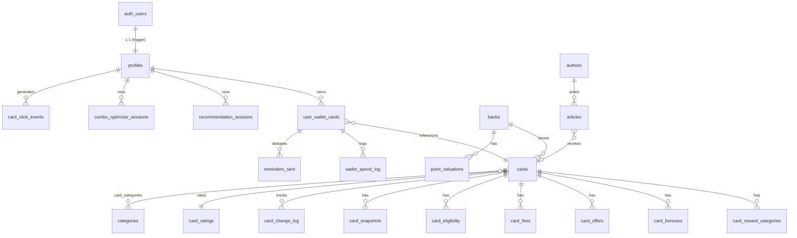

# Architecture — CardCompare.in

> Technical architecture guide for the CardCompare.in credit card comparison platform.

---

## Table of Contents

- [System Overview](#system-overview)
- [High-Level Architecture](#high-level-architecture)
- [Frontend Architecture](#frontend-architecture)
- [Backend Architecture](#backend-architecture)
- [Database Schema](#database-schema)
- [Edge Functions (API Surface)](#edge-functions-api-surface)
- [Data Pipeline](#data-pipeline)
- [Security Architecture](#security-architecture)
- [SEO & Structured Data](#seo--structured-data)
- [Design System](#design-system)
- [Deployment Architecture](#deployment-architecture)

---

## System Overview

CardCompare.in is an **Astro 5 hybrid SSG/SSR** application using the **Islands Architecture** pattern. The vast majority of pages are statically generated at build time, with 6 React islands providing client-side interactivity. Supabase serves as the sole backend — providing the database, auth, serverless edge functions, and object storage.

### Key Architectural Decisions

| Decision | Rationale |
|---|---|
| **Astro SSG-first** | Credit card data changes weekly, not per-request. Static pages = fastest possible TTFB and zero server cost for 95% of traffic |
| **React Islands (not SPA)** | Interactive tools (recommender, optimizer) need state; card listings don't. Islands keep the JS bundle small |
| **Supabase over custom backend** | Auth, RLS, Edge Functions, Storage, and Postgres in one platform — no infra to manage |
| **Dual-mode data layer** | Seed-data fallback lets the site build without Supabase — enables CI/CD and local dev without a live database |
| **Edge Functions for scoring** | Recommendation/optimization logic runs server-side to protect business logic and avoid shipping large scoring code to the client |
| **Custom CSS tokens** | Full design control without framework lock-in. 80+ CSS custom properties, zero hardcoded values |

---

## High-Level Architecture

```
┌─────────────────────────────────────────────────────────────┐
│                        USERS                                │
│  Browser (Static HTML + React Islands)                      │
└──────────────┬──────────────────────┬───────────────────────┘
               │ Static pages         │ Interactive tools
               │ (build-time data)    │ (runtime API calls)
               ▼                      ▼
┌──────────────────────┐   ┌──────────────────────────────────┐
│   CDN / Static Host  │   │      Supabase Platform           │
│                      │   │  ┌────────────────────────────┐  │
│  - HTML/CSS/JS       │   │  │    Edge Functions (Deno)    │  │
│  - Card images       │   │  │  ┌──────────────────────┐  │  │
│  - OG images         │   │  │  │ recommend-cards      │  │  │
│                      │   │  │  │ optimize-combo       │  │  │
│  ┌────────────────┐  │   │  │  │ best-card-for-purch. │  │  │
│  │  Node SSR      │  │   │  │  │ detect-card-changes  │  │  │
│  │  /wallet only  │  │   │  │  │ send-change-alerts   │  │  │
│  └────────────────┘  │   │  │  │ send-fee-reminders   │  │  │
│                      │   │  │  └──────────────────────┘  │  │
└──────────────────────┘   │  ├────────────────────────────┤  │
                           │  │    PostgreSQL + RLS         │  │
                           │  │    24 tables, 3 views       │  │
                           │  ├────────────────────────────┤  │
                           │  │    Auth (magic link OTP)    │  │
                           │  ├────────────────────────────┤  │
                           │  │    Storage (card images,    │  │
                           │  │    author headshots)        │  │
                           │  └────────────────────────────┘  │
                           └──────────────────────────────────┘
                                          ▲
                                          │ Offline scripts
                           ┌──────────────┴───────────────────┐
                           │       Data Pipeline (CLI)         │
                           │  import-cards.ts → parse + upsert │
                           │  enrich-cards.ts → parse JSON     │
                           │    (deterministic, no API)        │
                           └───────────────────────────────────┘
```

---

## Frontend Architecture

### Rendering Strategy

```
                    ┌──────────────────────────────────┐
                    │           Astro Build             │
                    │                                    │
                    │  getStaticPaths() + frontmatter   │
                    │  queries → Supabase OR seed-data  │
                    │                                    │
                    │  ┌─────────────┐ ┌─────────────┐ │
                    │  │ Static HTML │ │ React Islands│ │
                    │  │  (no JS)    │ │  (hydrated)  │ │
                    │  └─────────────┘ └─────────────┘ │
                    └──────────────────────────────────┘
```

| Mode | Pages | Strategy |
|---|---|---|
| **SSG** (`prerender = true`) | All except `/wallet` | Built at deploy time; data baked into static HTML |
| **SSR** (`prerender = false`) | `/wallet` only | Rendered on-demand per request (auth session required) |

### Layout Hierarchy

```
BaseLayout.astro
  │  HTML shell, <head> (SEO meta, JSON-LD, fonts), design tokens
  │
  └── PageLayout.astro
        │  GlobalHeader (sticky nav, mega-menu, mobile drawer)
        │  <main> slot
        │  SiteFooter (4-column nav, 3 legal disclosures)
        │
        └── ArticleLayout.astro
              Breadcrumbs, AffiliateDisclosure, AuthorByline,
              Article body, NewsletterForm
```

### Component Architecture

**16 Astro Components** — server-rendered, zero JS:

| Component | Responsibility |
|---|---|
| `GlobalHeader` | Sticky nav with 5-section mega-menu flyouts, mobile hamburger, "Check My Eligibility" CTA |
| `CardRow` | Core card display unit — collapsed summary with expandable detail panel (reward categories, fees, editor's take) |
| `ComparisonTable` | Semantic `<table>` — 2 variants: "cards" (column-per-card) and "listing" (wide summary) |
| `FilterSortBar` | Client-side filtering via vanilla JS `data-*` attributes (no React needed) |
| `RatingWidget` | Editorial x.x/5 rating with methodology disclosure toggle and sub-score breakdown |
| `CategoryPillStrip` | Horizontal scrolling category pills → `/best/[category]` |
| `Button` | Polymorphic button (renders `<a>` or `<button>`, 4 variants, optional microcopy) |
| `StickyApplyBanner` | Bottom sticky bar on card reviews with affiliate "Apply Now" CTA |
| `NewsletterForm` | Email subscribe → direct Supabase insert to `newsletter_subscribers` |
| `Breadcrumbs`, `AuthorByline`, `ProsConsBlock`, `ScoreTierBadge`, `AffiliateDisclosure`, `AsSeenOnStrip`, `SiteFooter` | Supporting UI |

**6 React Islands** — client-hydrated interactive tools:

| Island | Hydration | Calls | Fallback |
|---|---|---|---|
| `RecommendWizard` | `client:load` | `recommend-cards` Edge Function | Seed-based preview |
| `ComboOptimizer` | `client:visible` | `optimize-combo` Edge Function | Seed-based preview |
| `BestCardCalculator` | `client:visible` | `best-card-for-purchase` Edge Function | Seed-based preview |
| `CompareTool` | `client:load` | Supabase queries (anon) | Seed data |
| `SearchBox` | `client:load` | `search_site` RPC | Client-side fallback index |
| `WalletDashboard` | `client:only="react"` | Supabase Auth + RLS queries | Auth gate (no fallback) |

### Data Access Layer

`src/lib/queries.ts` is the single source of page data. Each **catalog** read is
**three-way resilient** — it never lets a misconfigured or empty database blank
the site:

```
┌────────────────────────────────────────────────────────────────┐
│                     src/lib/queries.ts                          │
│                                                                 │
│  catalog read (cards, banks, categories, articles, changelog…)  │
│    ├── hasSupabaseEnv == false ─────────────────▶ seed-data     │
│    ├── live query ERRORS (tables not migrated) ─▶ seed-data +   │
│    │                                             warnOnce(...)  │
│    ├── live query returns 0 ROWS (not imported) ▶ seed-data +   │
│    │                                             warnOnce(...)  │
│    └── live query returns rows ─────────────────▶ LIVE data     │
│                                                                 │
│  helper: liveArray(label, run, seedValue, emptyIsFallback=true) │
│                                                                 │
│  Exported: getCardListing(category?), getCardBySlug(bank,card), │
│    getBanks, getBankBySlug, getCategories, getAuthors,          │
│    getArticles(type?), getChangeLog, getAllCardSlugs, …         │
└────────────────────────────────────────────────────────────────┘
```

Notes:
- The fallback is **catalog-only**. **User-scoped** reads (wallet) do *not* fall
  back to seed — an empty wallet legitimately returns nothing.
- `warnOnce(label, detail)` logs each distinct fallback once during a build,
  stating *why* (missing tables → "run the migrations"; 0 rows → "import the
  catalog"). This makes "no cards showing" self-diagnosing.
- **SSG reads at build time.** After importing data you must `npm run build`
  again for static pages to pick up live data (in `npm run dev` a refresh works).

This design means:
- `astro build` succeeds **with or without** Supabase configured.
- The site is **never blank** while Supabase is mid-setup (empty/erroring DB
  transparently shows seed data + a warning).
- Local dev and CI preview builds work offline with realistic sample data.

### Supabase Client Factories (`src/lib/supabase.ts`)

| Client | Usage | Scope |
|---|---|---|
| `getAnonClient()` | Build-time SSG queries + browser-side calls | `PUBLIC_SUPABASE_URL` + `PUBLIC_SUPABASE_ANON_KEY` |
| `getServiceClient()` | Import/enrich scripts only | `SUPABASE_URL` + `SUPABASE_SERVICE_ROLE_KEY` — guarded against browser import |

### Edge Function Wrappers (`src/lib/edge-functions.ts`)

Typed client-side wrappers that call Supabase Edge Functions via `supabase.functions.invoke()`:

```typescript
recommendCards(input)         → POST /recommend-cards
optimizeCombo(input)          → POST /optimize-combo
bestCardForPurchase(input)    → POST /best-card-for-purchase
searchSite(query)             → RPC  search_site(query)
```

All islands have **preview/fallback modes** — if Edge Functions are unavailable, they display seed-based preview data with a "Preview mode" banner.

---

## Backend Architecture

### Edge Functions Overview

All Edge Functions live under `supabase/functions/` and share common utilities from `_shared/`:

```
supabase/functions/
├── _shared/
│   ├── client.ts          CORS, service/user client factories, json() helper
│   ├── scoring.ts         inrPerPoint(), categoryValuePer100()
│   └── taxonomy.ts        Spend categories, goal enums, spend bands, etc.
├── recommend-cards/
├── optimize-combo/
├── best-card-for-purchase/
├── detect-card-changes/
├── send-change-alerts/
└── send-fee-waiver-reminders/
```

### Edge Function Details

#### 1. `recommend-cards` — Smart Recommendation Engine

```
POST /functions/v1/recommend-cards
Auth: None (uses service-role internally)

Input: {
  goal, monthly_spend_band, top_categories[],
  air_travel_frequency, employment_type,
  annual_income_band, cibil_band, fee_preference
}

Pipeline:
  1. Hard-filter by eligibility (employment, income, CIBIL)
  2. Score 0–100 across 5 weighted dimensions:
     ├── category_match:  35%  (how well rewards align with user's top categories)
     ├── net_value:       30%  (estimated annual reward − annual fee)
     ├── travel_fit:      15%  (lounge visits, forex markup for frequent flyers)
     ├── fee_pref:        10%  (lifetime-free preference matching)
     └── editorial_prior: 10%  (editorial score as prior)
  3. Return top-3 + stretch pick + lifetime-free fallback

Output: [{ card_id, card_slug, card_name, total_score,
           subscores, reasons[], estimated_annual_value_inr,
           fee_waiver_note }]

Side effect: Logs to recommendation_sessions (best-effort)
```

#### 2. `optimize-combo` — Best Card Combination

```
POST /functions/v1/optimize-combo
Auth: None (uses service-role internally)

Input: {
  category_spend: { groceries: 5000, dining: 3000, ... },
  max_cards: 2 | 3,
  eligibility: { employment_type, annual_income_band, cibil_band },
  max_total_annual_fee?: number
}

Pipeline:
  1. Hard eligibility filter
  2. Compute per-card per-category ₹/₹100 rates
  3. Pre-rank top 40 candidates
  4. Greedy marginal-value build:
     ├── Card #1 = best single card across all categories
     ├── Card #N = highest marginal value gain
     └── Stop if marginal value ≤ 0
  5. Winner-take-all per-category assignment
  6. Recompute totals (fee waived only if assigned spend clears threshold)
  7. Generate warnings (lounge overlap, redundant coverage)
  8. Return primary combo + one alternate (max_cards-1)

Output: [{ cards[], per_category_assignment,
           total_annual_reward_value_inr,
           total_annual_fees_inr, net_value_inr,
           warnings[] }]

Side effect: Logs to combo_optimizer_sessions
```

#### 3. `best-card-for-purchase` — Per-Transaction Advisor

```
POST /functions/v1/best-card-for-purchase
Auth: Dual — service client + user client (if authenticated)

Input: {
  category_key: string,
  amount_inr: number,
  card_ids?: string[]   // if omitted + authenticated → user's wallet
}

Pipeline:
  1. Resolve candidate cards (explicit IDs or wallet via RLS)
  2. For each card: compute best ₹ value for amount × category
  3. Add milestone-proximity nudge (within 20% of bonus threshold)

Output: [{ card_id, card_name, estimated_value_inr,
           redemption_note, milestone_nudge }]  // sorted by value
```

#### 4. `detect-card-changes` — Weekly Change Detector

```
POST /functions/v1/detect-card-changes
Auth: Service-role only (triggered by pg_cron weekly)

Pipeline:
  1. For each active card: compare two most recent card_snapshots
  2. Diff 8 watched fields:
     joining_fee, annual_fee, waiver_threshold, forex_markup,
     reward_rate, cibil_min, lounge_visits
  3. Classify changes:
     fee_increase | fee_decrease | reward_devaluation |
     reward_improvement | benefit_added | benefit_removed |
     eligibility_change
  4. Insert into card_change_log
  5. Invoke send-change-alerts for affected wallet cards

Output: { inserted: number, affected_cards: number }
```

#### 5. `send-change-alerts` — Email Notifications for Card Changes

```
POST /functions/v1/send-change-alerts
Auth: Service-role only (invoked by detect-card-changes)

Pipeline:
  1. Fetch latest change summaries
  2. Find wallet owners holding affected cards
  3. Check dedupe guard (reminders_sent, 14-day window)
  4. Send emails via Resend API
  5. Log to reminders_sent

Output: { sent: number }
```

#### 6. `send-fee-waiver-reminders` — Daily Fee-Waiver Nudges

```
POST /functions/v1/send-fee-waiver-reminders
Auth: Service-role only (triggered by pg_cron daily)

Pipeline:
  1. For each wallet card with card_opened_date + billing_cycle_day:
     ├── Compute days remaining in fee-waiver period
     └── Calculate spend gap to meet waiver threshold
  2. If within 30-day window AND gap > 0:
     ├── Send Resend email (with 14-day dedupe)
     └── Log to reminders_sent

Output: { sent: number, skipped: number }
```

---

## Database Schema

### Entity Relationship Diagram



### Tables by Domain

#### Catalog Domain (Migration 1) — 11 Tables

| Table | Rows | Purpose |
|---|---|---|
| `banks` | ~20 | Bank issuers (HDFC, ICICI, Axis, SBI, etc.) |
| `categories` | 12 | Content taxonomy (cashback, travel, rewards, fuel, etc.) |
| `cards` | ~368 | Core card data — ~50 columns covering fees, rewards, eligibility, network, tier |
| `card_categories` | N:M | Junction table: cards ↔ categories |
| `card_reward_categories` | varies | Per-category reward rates (groceries 5×, dining 10×, etc.) |
| `card_bonuses` | varies | Welcome, milestone, anniversary bonuses |
| `card_offers` | varies | Active merchant/category offers |
| `card_fees` | varies | Granular fee breakdown (12 fee types) |
| `card_eligibility` | varies | Employment type, min income, min CIBIL |
| `card_snapshots` | grows | JSON snapshots for change detection (service-role only) |
| `card_change_log` | grows | Detected changes with old→new values |

**Key columns on `cards`:**
- `card_type` — `'credit'` \| `'debit'`
- `network` — `'visa'` \| `'mastercard'` \| `'rupay'` \| `'amex'` \| `'diners'`
- `reward_type` — `'points'` \| `'cashback'` \| `'miles'` \| `'hybrid'`
- `data_confidence` — `'verified'` \| `'partially_estimated'` \| `'estimated'`
- `editorial_score_5` — editorial rating (0.0–5.0)
- `is_active` — soft delete flag

#### Editorial Domain (Migration 2) — 4 Tables

| Table | Purpose |
|---|---|
| `authors` | Editorial team with expertise tags, review board flag |
| `card_ratings` | 5-dimension editorial ratings (rewards, fees, welcome, flexibility, service) |
| `articles` | CMS-style content (card_review, category_roundup, guide, news) |
| `point_valuations` | ₹-per-point conversion rates by bank and redemption channel |

#### User & Wallet Domain (Migration 3) — 8 Tables

| Table | Purpose |
|---|---|
| `profiles` | User profiles (auto-created via trigger on `auth.users` INSERT) |
| `user_wallet_cards` | Cards in user's personal wallet |
| `wallet_spend_log` | Manual spend tracking entries |
| `recommendation_sessions` | Analytics: recommendation wizard sessions |
| `combo_optimizer_sessions` | Analytics: combo optimizer sessions |
| `newsletter_subscribers` | Email signups (INSERT-only, never client-readable) |
| `card_click_events` | Affiliate click tracking (INSERT-only) |
| `reminders_sent` | Email dedupe guard (14-day window) |

#### Views (Migration 4) — 2 Views

| View | Purpose | Access |
|---|---|---|
| `card_listing_view` | Flattened cards + banks + primary category + score for `/best/[category]` pages | anon, authenticated |
| `wallet_summary_view` | Per-user wallet dashboard metrics (card count, total fees, lounges, renewals due) | authenticated only |

Both use `security_invoker = true` so underlying RLS still applies.

#### Search (Migration 5)

- **`search_tsv`** tsvector column on `cards` — weighted: A=name, B=bank_name, C=tier, D=reward_rate
- **`search_tsv`** tsvector column on `articles` — weighted: A=title, D=body
- **GIN indexes** on both columns
- **`search_site(query)`** RPC function — unions ranked results across cards + articles (limit 50)

#### Storage (Migration 6) — 2 Buckets

| Bucket | Public | Write Access |
|---|---|---|
| `card-images` | Yes | Service-role only |
| `author-headshots` | Yes | Service-role only |

#### Data Quality (Migration 7)

- **`data_quality_flags`** view — surfaces active cards missing annual_fee, cibil_min, reward_categories, or eligibility. Service-role only.

### Index Strategy

Key indexes on high-query columns:

```
idx_cards_bank_id            → cards(bank_id)
idx_cards_annual_fee         → cards(annual_fee_amount)
idx_cards_cibil_min          → cards(cibil_min)
idx_cards_is_active          → cards(is_active)
idx_card_categories_category → card_categories(category_id)
idx_crc_card                 → card_reward_categories(card_id)
idx_crc_key                  → card_reward_categories(category_key)
idx_crc_needs_review         → card_reward_categories(needs_review)
idx_snapshots_card_time      → card_snapshots(card_id, snapshotted_at)
idx_changelog_card           → card_change_log(card_id)
+ GIN indexes on search_tsv columns
```

---

## Data Pipeline

### Overview

```
┌───────────────────┐     ┌───────────────────┐     ┌────────────────────┐
│  Source Data       │     │  Structured Import │     │  Enrichment (JSON)  │
│                    │     │                    │     │  deterministic — no │
│  Master-data-      │────▶│  import-cards.ts   │────▶│  external API       │
│  banks.json        │     │                    │     │  enrich-cards.ts    │
│  (368 cards)       │     │  Parses + upserts: │     │                     │
│                    │     │  banks, cards,      │     │  Parses free-text   │
│  card-img/         │     │  snapshots,         │     │  → reward_cats,     │
│  (368 PNGs)        │     │  eligibility,       │     │  bonuses, offers    │
│                    │     │  card_categories    │     │                     │
└───────────────────┘     └───────────────────┘     └────────────────────┘
```

### Stage 1: Source Data (`bank-data/`)

| File | Description |
|---|---|
| `cc-data/Master-data-banks.json` | 368 card records across ~20 banks (585KB) |
| `cc-data/axisfinaldone18jun2026.xlsx` | Original Excel spreadsheet |
| `cc-data/convert_xlsx_to_json.py` | Python converter (openpyxl → JSON) |
| `cc-data/card-img/` | 368 card art PNG images |

### Stage 2: Structured Import (`scripts/import-cards.ts`)

- **Parser library** (`scripts/lib/parse.ts`, 24KB): 20+ pure functions for Indian credit card data:
  - `parseMoney()` — handles ₹, Rs., Lakh, Crore, "Nil"/"Lifetime Free"
  - `parseCibil()` — "750+ (est)" → `{750, estimated: true}`
  - `parseNetwork()` — multi-network support, Visa/MC/RuPay/Amex/Diners
  - `parseRewardType()` — normalizes CashPoints/NeuCoins/InterMiles → standard types
  - `parseLounge()` — annualizes per-quarter/month, handles "unlimited" → 99
  - `parseEligibility()` — splits salaried/self-employed income segments
  - `deriveConfidence()` — counts estimated fields → data confidence level
  - Plus 10+ more parsers

- **Import modes:**
  - `--dry-run` (default): Parse + validate + print stats, no DB writes
  - Live: Upserts banks → cards → snapshots → eligibility → card_categories. Triggers deploy hook.

### Stage 3: Deterministic Enrichment (`scripts/enrich-cards.ts`)

- **No external API.** Parses the source JSON's free-text reward/bonus/offer prose
  with the pure parsers in `scripts/lib/parse.ts` (`parseRewardCategories`,
  `parseBonuses`, `parseOffers`).
- Handles the two reward-text styles: `;`-separated clauses ("A: 3X; B: 2X") and
  comma-separated rates ("10% on X, 5% on Y"); emits a row per category in a
  shared-rate clause ("hotel, recharge and shopping: 2X" → 3 rows).
- Guards against misparses: "X% off"/discounts are NOT treated as earn rates;
  reward `%` is capped at 20; thresholds are lakh/crore-aware (won't split
  `₹1,00,000`).
- Extracts into: `card_reward_categories`, `card_bonuses`, `card_offers`
  (tagged `parsed_by_llm=false, needs_review=true`).
- Recomputes `base_reward_value_inr_per_100` from the general rate × the matching
  `point_valuations` row.
- Idempotent — clears a card's parsed rows before re-inserting; safe to re-run.

---

## Security Architecture

### RLS Policy Tiers

```
┌─────────────────────────────────────────────────────────┐
│                    RLS TIERS                            │
│                                                         │
│  Tier 1: PUBLIC CATALOG (read-only)                     │
│  ┌───────────────────────────────────────────────────┐  │
│  │ banks, categories, cards, card_categories,         │  │
│  │ card_reward_categories, card_bonuses, card_offers, │  │
│  │ card_fees, card_eligibility, card_change_log,      │  │
│  │ authors, card_ratings, point_valuations             │  │
│  │                                                     │  │
│  │ Policy: anon + authenticated → SELECT               │  │
│  │         service_role → ALL                          │  │
│  └───────────────────────────────────────────────────┘  │
│                                                         │
│  Tier 2: OWNER-SCOPED (user data)                       │
│  ┌───────────────────────────────────────────────────┐  │
│  │ profiles, user_wallet_cards, wallet_spend_log,     │  │
│  │ reminders_sent                                      │  │
│  │                                                     │  │
│  │ Policy: authenticated → CRUD own rows only          │  │
│  │         (user_id = auth.uid() or EXISTS subquery)   │  │
│  │         service_role → ALL                          │  │
│  └───────────────────────────────────────────────────┘  │
│                                                         │
│  Tier 3: INTERNAL (service-role only)                   │
│  ┌───────────────────────────────────────────────────┐  │
│  │ card_snapshots, data_quality_flags                  │  │
│  │                                                     │  │
│  │ Policy: service_role → ALL                          │  │
│  │         No anon/authenticated access                │  │
│  └───────────────────────────────────────────────────┘  │
│                                                         │
│  Special Cases:                                         │
│  ├── articles: public SELECT only WHERE is_published    │
│  ├── newsletter_subscribers: INSERT only (never read)   │
│  ├── card_click_events: INSERT only (never read)        │
│  ├── recommendation_sessions: anon INSERT, auth SELECT  │
│  └── combo_optimizer_sessions: anon INSERT, auth SELECT │
└─────────────────────────────────────────────────────────┘
```

### Auth Flow

```
User clicks "Sign in" in WalletDashboard
  │
  ▼
Supabase Auth: signInWithOtp({ email })
  │
  ▼
User clicks magic link in email
  │
  ▼
Supabase Auth callback → session established
  │
  ▼
Trigger: handle_new_user() auto-creates profiles row
  │ (SECURITY DEFINER — runs with elevated permissions)
  │
  ▼
WalletDashboard renders with RLS-scoped wallet data
  (user_id = auth.uid() on all queries)
```

### Key Security Boundaries

| Boundary | Enforcement |
|---|---|
| Service-role key never in browser | `getServiceClient()` has `typeof window` guard |
| User data isolation | RLS `user_id = auth.uid()` on all wallet tables |
| Draft articles hidden | RLS `is_published = true` filter on `articles` |
| Analytics write-only | `newsletter_subscribers` and `card_click_events` are INSERT-only |
| Snapshot data internal | `card_snapshots` has zero anon/authenticated policies |
| Email dedupe | `reminders_sent` with 14-day window prevents spam |
| No PII collection | No PAN, Aadhaar, or sensitive financial data stored |

---

## SEO & Structured Data

### Per-Page SEO

Every page includes:
- Unique `<title>` tag
- `<meta name="description">` with compelling copy
- Canonical URL (`https://cardcompare.in/...`)
- Open Graph tags (title, description, image, type)
- Twitter Card tags
- Proper heading hierarchy (single `<h1>` per page)
- Semantic HTML5 elements

### JSON-LD Structured Data (`src/lib/seo.ts`)

| Schema Type | Used On |
|---|---|
| `FinancialProduct` | Card review pages (`/cards/[bank]/[card]`) |
| `BreadcrumbList` | Nearly all pages |
| `FAQPage` | Card reviews, category listings, CIBIL hub |
| `Article` | Guide and news pages |
| `Person` | Author profile pages |

### Search Engine Features

- **Sitemap** auto-generated via `@astrojs/sitemap`
- **`noindex`** on `/wallet` and `/search` (dynamic, personalized content)
- External apply links use `rel="nofollow sponsored noopener"`

---

## Design System

### CSS Architecture

```
src/styles/
├── tokens.css      164 lines — 80+ CSS custom properties
├── global.css      131 lines — resets, typography, utilities
└── islands.css      96 lines — shared React island styles
```

**Zero hardcoded hex or px values** — every Astro component and page references `var(--token)`.

### Token Categories

| Category | Examples |
|---|---|
| **Colors** | Brand blue `#0057B8`, 10-step neutral scale, CTA green, 5-tier rating scale, semantic feedback |
| **Typography** | Roboto + Noto Sans (Indic-safe), 11-step type scale (12px–40px), 4 font weights |
| **Spacing** | 8px base grid with 4px half-step (12 values: 4px–96px) |
| **Radius** | sm(4px), md(8px), lg(12px), pill(999px), circle(50%) |
| **Shadows** | 4 elevation levels + hover shadow |
| **Motion** | fast(120ms), base(200ms), slow(320ms), 3 easing curves |
| **Layout** | container-max(1200px), reading-max(720px), rail-width(340px) |
| **Breakpoints** | 480 / 768 / 1024 / 1200px |

### Accessibility

| Feature | Implementation |
|---|---|
| Skip-to-content | On every page |
| Focus indicators | `:focus-visible` ring sitewide |
| Touch targets | 44px minimum enforced |
| Reduced motion | `prefers-reduced-motion` collapses all animations |
| ARIA attributes | `aria-expanded`, `aria-controls`, `aria-pressed`, `aria-live="polite"` |
| Screen readers | `.sr-only` labels on icons and decorative elements |

---

## Deployment Architecture

### Build Output

```bash
npm run build
```

Produces:
- **Static HTML/CSS/JS** for all SSG pages → deploy to any CDN
- **Node.js SSR server** for `/wallet` → requires Node runtime

### Environment Variables

| Variable | Required | Scope | Purpose |
|---|---|---|---|
| `PUBLIC_SUPABASE_URL` | Yes | Client + Server | Supabase project URL |
| `PUBLIC_SUPABASE_ANON_KEY` | Yes | Client + Server | Anon key for RLS-scoped queries |
| `SUPABASE_URL` | For scripts | Server only | Same URL, used by import scripts |
| `SUPABASE_SERVICE_ROLE_KEY` | For scripts | Server only | Admin access for data imports |
| `SUPABASE_PUBLISHABLE_KEY` | For Edge Functions | Server only | New-style publishable key |
| `RESEND_API_KEY` | Optional | Server only | Email sending (change alerts, reminders) |
| `DEPLOY_HOOK_URL` | Optional | Server only | Trigger rebuild after data import |

### Scheduled Jobs

| Job | Frequency | Edge Function |
|---|---|---|
| Card change detection | Weekly (pg_cron) | `detect-card-changes` |
| Fee-waiver reminders | Daily (pg_cron) | `send-fee-waiver-reminders` |

### Rebuild Cycle

```
Data change (import/enrich)
  │
  ▼
DEPLOY_HOOK_URL triggered
  │
  ▼
Static site rebuild (SSG pages regenerated with fresh data)
  │
  ▼
CDN cache invalidated → users see updated content
```

---

## Summary Statistics

| Metric | Count |
|---|---|
| **Routes** | 25+ (24 SSG + 1 SSR) |
| **Astro Components** | 16 |
| **React Islands** | 6 |
| **Edge Functions** | 6 |
| **Database Tables** | 24 |
| **Database Views** | 3 |
| **Storage Buckets** | 2 |
| **RLS Policies** | ~50 |
| **CSS Custom Properties** | 80+ |
| **Source Cards** | 368 |
| **Supported Banks** | 20+ |
| **Content Categories** | 12 |

---

<p align="center">
  <em>Last updated: July 2026</em>
</p>
